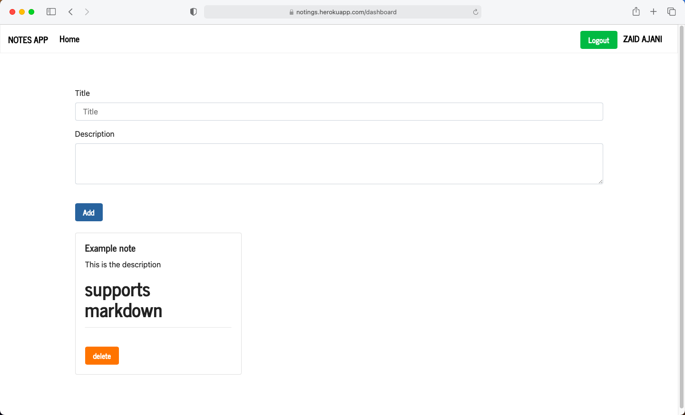

# Notings app

This is an application which has login system with notes

### Version: 1.0.0

### Usage

```sh
$ npm install
```

```sh
$ npm start
# Or run with Nodemon
$ npm run dev

# Visit http://localhost:3000
```

### MongoDB

Open "config/keys.js" and add your MongoDB URI, local or Atlas

## preview



visit <a href="https://notings.herokuapp.com/">https://notings.herokuapp.com/</a> For preview

<bold>Enjoy your powerful application</bold>
